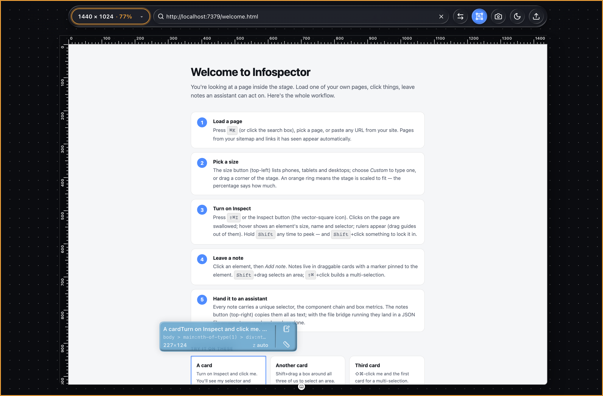

# Infospector — Site Notes

**A drop-in tool to review any page, leave notes, resize the canvas, take screen captures, draw rulers, and get info on any element — so your AI always knows the right thing to work on.**



Load any page from your site into a resizable **stage**, point at exactly what you mean, and hand your coding assistant a precise, structured note — the element's selector, component chain, size and your comment — instead of a vague "fix the thing near the header." One folder of static files, no build, no dependencies.

## What it does

- **Review at any size.** Drop your page onto a centered stage and switch between phones, tablets, watches and desktop viewports, type a custom size, drag the corners, or rotate landscape ↔ portrait. Oversized views scale to fit.
- **Leave notes an AI can act on.** Click an element and add a note. Every note captures a unique CSS selector, the React component chain, `data-testid` and box metrics — so an assistant knows *exactly* which element you mean.
- **Inspect anything.** Turn on Inspect (**⇧⌘I**) and the page's own clicks are held back while a floating panel shows any element's size, name, id, z-index and selector — each field one click to copy.
- **Draw rulers and guides.** Rulers run along the top and left; drag out guides that snap to element edges, and wrap any element in four guides at once.
- **Measure the gaps.** Hold **⌘/Ctrl** between two guides to read the distance, then click to leave a note on that space.
- **Select an area or many elements.** Shift+drag a box to note a whole region (it records every element it touches); ⇧⌘-click to note several at once.
- **Capture the screen.** One shortcut grabs the stage exactly as it is — open menus, tooltips and notes included.
- **Track progress.** Notes carry a state — **open → noted → done** — and your assistant flips them as it works, live or by editing the notes file. Markers stay colored until every note is done.
- **Light or dark, searchable, keyboard-driven.** A theme toggle, a page search with history (**⌘K**), and a shortcuts panel (`?`). It opens at 1024 × 768 the first time and remembers your size after that.
- **Yours, everywhere.** Zero build, zero dependencies for the core; notes live in `localStorage` or an optional on-disk JSON file. **MIT licensed.**

## Install

Infospector is one folder of static files. It has to be served **from the same origin as the pages
you want to review** (that's what lets it read the page's DOM), so it lives inside your project's
static/public directory.

**1. Put the folder in your static directory**

| framework | put it at | then open |
| --- | --- | --- |
| Next.js, Vite, Create React App, Nuxt, Remix, Rails, Laravel | `public/labs/infospector/` | `/labs/infospector/` |
| Astro | `public/labs/infospector/` | `/labs/infospector/` |
| SvelteKit | `static/labs/infospector/` | `/labs/infospector/` |
| Hugo / Jekyll / Eleventy | `static/labs/infospector/` (or the passthrough dir) | `/labs/infospector/` |
| Django | your `STATICFILES_DIRS` folder, then `collectstatic` | `/static/labs/infospector/` |
| WordPress | `wp-content/infospector/` | `/wp-content/infospector/` |
| plain HTML | anywhere your server serves | that path |

`labs/` is just a convention — any path works. Don't put it in a route that's authenticated
differently from your pages.

**2. Open it and follow the first-run setup**

Open the folder's `index.html` in the browser (e.g. `http://localhost:3000/labs/infospector/`).
A small **Set up** card asks for your default page, theme, accent, and where notes live — or
**Skip**. It appears only on a true first run (a browser with no Infospector state and no
`config.js` settings); reopen it any time with `?setup`, and get a full self-check with `?doctor`.
Tip: **Copy config** on that card and paste into `config.js` — then every browser and every
port starts set up.

**3. Check the frame headers** (only if the stage says "This page can't be framed")

Your pages must allow being framed by their own origin. Either header below is fine; `DENY` /
`'none'` is not:

```
X-Frame-Options: SAMEORIGIN
Content-Security-Policy: frame-ancestors 'self'
```

That's it. Nothing to build, no dependencies, and deleting the folder removes it completely.

**Installing with an AI assistant?** Point it at [`INSTALL.md`](./INSTALL.md) — it's written as a
checklist an agent can follow (detect the framework, copy, verify with `?doctor`, ask the
questions that matter, write `config.js`).

### Configuration

| how | what |
| --- | --- |
| `?url=/path` | page to open |
| `?setup` / `?doctor` | reopen first-run setup / run the self-check |
| `?bridge=http://localhost:7331` | use the file bridge (see below) |
| `window.INFOSPECTOR_HOME = "/path"` | default page (in `config.js`) |
| `window.INFOSPECTOR_BRIDGE = "http://…"` | default bridge URL |
| `pages.json` (next to `index.html`) | curated list of pages for the search box — `[{ "title", "path", "type" }]` |
| `window.INFOSPECTOR_PAGES = [...]` in `config.js` | same shape, for projects that generate the list |

### How the search box knows your pages

Nothing to set up for the basics — the list builds itself, and gets better with a little help:

1. **Paste any URL** (or type a path) — it loads on the stage. Always works.
2. **Sitemap** — on boot it reads `/sitemap.xml` (or the one named in `robots.txt`), so a Next.js,
   Astro, WordPress, Hugo… site is searchable immediately.
3. **Links it sees** — every page you load on the stage is scanned for same-origin links, which
   are remembered (per browser) with their link text as the title.
4. **Curated** — drop a `pages.json` next to `index.html` (or set `window.INFOSPECTOR_PAGES` in
   `config.js`) to name and order the pages you care about; those always list first.

Sizes are one array at the top of `host.js` (`PRESETS`) — add or edit devices there, including each
device's corner radius.

### Making your look the default

Right-click the background to dial in the pattern, colors and glass (blur, saturation, highlight,
shadow, opacity, tint). **Backing** is a solid legibility layer under the glass —
your tint's hue, pushed dark in dark mode and light in light mode — so text stays readable over
any page. Colors are **theme-aware**: pick one in light mode and dark mode gets a hue-matched dark
version automatically (and vice versa); set it in both themes to control each exactly. Then:

- **Save as defaults** — remembers it in this browser. **Reset to defaults** returns to the shipped
  look (and forgets the browser-saved one).
- **Copy config snippet** — copies a `window.INFOSPECTOR_DEFAULTS = {…}` block; paste it into
  `config.js` so every browser (and every project you drop the folder into) starts with your look.

## What can be inspected

The inspector runs **inside** the framed page, which the browser only allows for **same-origin**
pages. So:

- **Your own pages (same origin):** full inspector + notes.
- **External URLs:** best-effort **view/screenshot only** — and many sites refuse to be framed at
  all (`X-Frame-Options` / CSP `frame-ancestors`). The toolbar chip says "view only" or "blocked".
  This is a browser security boundary, not a bug.

## Notes persistence

**Default — `localStorage`.** Nothing to run. Notes are keyed per page, per browser.

**Optional — file bridge.** Run the included zero-dependency server to persist notes to a JSON file
on disk (great for committing review notes, or letting an agent read/edit them):

```bash
node public/labs/infospector/server.mjs            # http://localhost:7331, ./infospector-notes.json
node public/labs/infospector/server.mjs --port 7331 --file .infospector-notes.json
```

Then point Infospector at it:

```
/labs/infospector/index.html?bridge=http://localhost:7331&url=/your/page
```

The browser polls the bridge, so edits you (or an agent) make to the notes file show up live. The
**⋯ menu** also has **Export / Import** to move notes around as JSON.

## Working with an AI agent

Two ways an assistant can read your notes and update their state:

1. **Live, via the browser.** A documented global is exposed on the Infospector window
   (`window.__previewTester` is kept as an alias):

   ```js
   window.__infospector.listTargets()             // -> Target[] (objects + their notes)
   window.__infospector.listNotes()               // -> flat [{ targetId, id, text, state, element }]
   window.__infospector.getNote(id)
   window.__infospector.setNoteState(id, "noted")    // open|noted|done (old reviewed/working/complete accepted)
   window.__infospector.updateNote(id, { text, state })
   window.__infospector.deleteNote(id)            // removes its object if it was the last note
   window.__infospector.setTargetRuler(targetId, true)
   window.__infospector.openTarget(targetId)      // open its modal + reveal if hidden
   window.__infospector.clearAll()
   window.__infospector.exportJSON() / importJSON(str)
   window.__infospector.allNotesText()            // paste-ready text of every note (also "Copy all notes" in the menu)
   window.__infospector.pageKey() / store()       // store: "localStorage" | "file bridge"
   ```

2. **Durable, via the notes file.** With the bridge running, the agent reads and edits
   `infospector-notes.json` directly — a map of `{ "<pageKey>": { version, pageKey, targets: [] } }`.
   Flip a note's `"state"` to `"working"` when it starts and `"complete"` when done; the browser
   picks up the change on its next poll.

### A target's shape

An object you've annotated is a **target**; it owns one or more notes.

```jsonc
{
  "id": "t…", "createdAt": "…", "updatedAt": "…",
  "ruler": false,                                   // dimension rulers shown
  "modal": { "x": 900, "y": 90, "open": true },     // draggable modal position/visibility
  "anchor": { "selector": "…", "frac": { "fx": 0.5, "fy": 0.5 }, "rectAtCapture": { … } },
  "element": {
    "name": "…", "tag": "a", "id": null,
    "selectors": ["body > … > a:nth-of-type(1)"],   // [0] is the best/unique one
    "components": ["LinkComponent", "HomeNavDesktop"], // React chain, if detectable
    "attrs": { "data-testid": "…", "href": "…" },
    "rect": { "x": 0, "y": 0, "width": 0, "height": 0 },
    "zIndex": "auto",
    "style": { "borderRadius": "…", "padding": "…" }
  },
  "notes": [
    { "id": "n…", "text": "Tighten the logo lockup spacing", "state": "open",
      "createdAt": "…", "updatedAt": "…" }
  ]
}
```

## Security notes

- The stage iframe is sandboxed (no top-navigation), and host ↔ inspector messages are pinned to
  the same origin and checked against the actual frame, so a framed page can't spoof the tool.
- The file bridge is a local helper that answers CORS `*`; keep it on localhost.

## Bookmarklet (inspector only)

`bookmarklet.js` is a standalone element inspector for *any* page (no stage, no notes):

```
javascript:(()=>{const s=document.createElement('script');s.src=location.origin+'/labs/infospector/bookmarklet.js?t='+Date.now();document.body.appendChild(s)})()
```

Shift+click an element for a copy-ready identity block.

## Files

| file | purpose |
| --- | --- |
| `CHANGELOG.md` | what changed in each version (PRs add to *Unreleased*; releases are tagged on GitHub) |
| `INSTALL.md` | step-by-step install checklist written for an AI assistant to follow |
| `index.html` | the host page (floating toolbar + stage) |
| `welcome.html` | the how-to page the stage opens on a fresh install |
| `host.css` / `host.js` | UI, sizing, presets, typeahead + history, theme, screenshot, notes, robot API |
| `inspector.js` | injected into the framed page: element picking, pins, rulers, reveal |
| `adapters.js` | persistence adapters (localStorage + file bridge) |
| `server.mjs` | optional zero-dependency file-bridge server |
| `pages.json` | optional page manifest for the search box |
| `bookmarklet.js` | standalone shift+click inspector for any page |
| `vendor/html-to-image.js` | enables the screenshot button ([html-to-image](https://github.com/bubkoo/html-to-image), MIT) |
| `lib.js` | pure helpers (colors, pages, migration) shared by host.js and the unit tests |
| `test/` | `unit/` (node --test), `e2e/` (Playwright), `serve.mjs` (zero-dep static server) |

## Tests

The tool itself has no dependencies; the tests do (Playwright, dev-only). From this folder:

```bash
npm install            # once: @playwright/test
npx playwright install chromium
npm test               # unit (node --test, pure helpers in lib.js) + e2e (real Chromium against welcome.html)
```

`npm run test:unit` is instant and dependency-free; `npm run test:e2e` starts `test/serve.mjs` on
:7377 and drives the real UI: inspect, select, notes, ruler wrap, guide snapping, ⌘-hover gap
notes, clear-all, shortcuts. Never run `npm install` inside a project's `public/` copy — run the
tests from a clone of the repo.

## License

MIT © 2026 Q Manning. See [LICENSE](./LICENSE).

---

Made by [Q Manning](https://qmanning.com) · [Source on GitHub](https://github.com/qmanning/infospector) · [See it live in the Labs](https://qmanning.com/labs/infospector)
